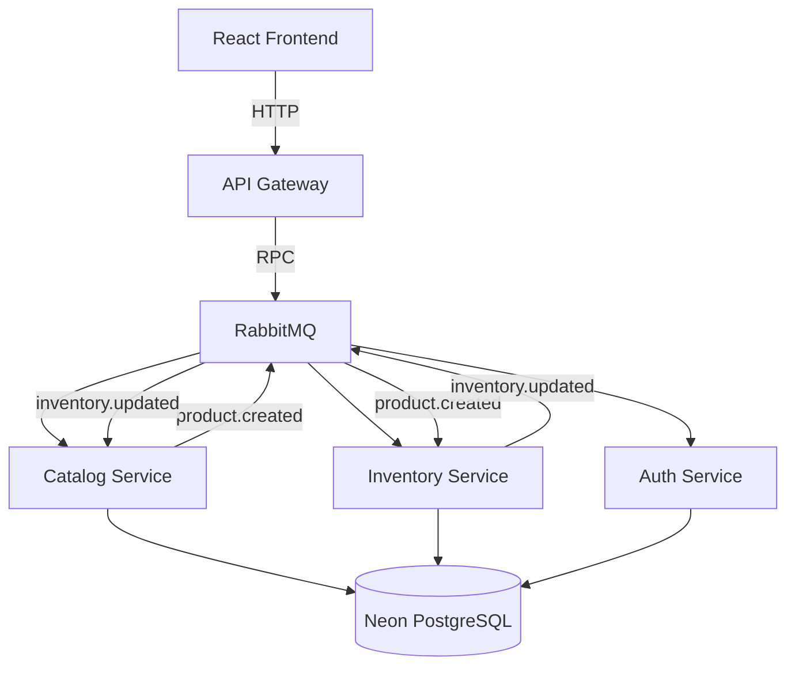

# Challenge Sr Fullstack (Microservicios)

Repositorio monorepo con la solucion completa del challenge:

- backend base analizado y saneado (`nestjs-ecommerce`)
- backend evolucionado a microservicios event-driven (`microservices/*`)
- frontend React con Vite para validacion end-to-end (`react-ecommerce`)
- infraestructura de mensajeria: RabbitMQ local (`infra/docker-compose.yml`) para desarrollo; [CloudAMQP](https://cloudamqp.com) para produccion (Fly.io)

## 1) Problemas detectados en el diseno original

Principales hallazgos en `nestjs-ecommerce`:

- tests de controladores acoplados a modulos de DB y autenticacion
- e2e con problemas de cleanup (`app.close` sin ejecutar correctamente)
- e2e con dependencias fragiles en tokens de repositorio hardcodeados
- guard/auth consumiendo `process.env` directamente con comportamiento fragil
- modulo de productos fuertemente acoplado a `EntityManager`, dificultando evolucion de dominio
- base monolitica poco preparada para desacople asincronico entre catalogo e inventario

Correcciones aplicadas:

- aislamiento de tests unitarios de controladores (desacoplados de DB)
- estabilizacion de e2e con `getRepositoryToken(User)` y cleanup async correcto
- teardown corregido con `await app.close()`
- saneamiento basico para tener baseline reproducible antes de evolucionar

## 2) Eventos implementados y por que

Se implementaron dos eventos de dominio relevantes:

1. `product.created`
   - productor: `catalog-service`
   - consumidor: `inventory-service`
   - objetivo: crear/asegurar el registro inicial de inventario de manera desacoplada

2. `inventory.updated`
   - productor: `inventory-service`
   - consumidor: `catalog-service`
   - objetivo: actualizar `lastKnownStock` como read model para consultas del catalogo

Con esto se evita comunicacion sincrona innecesaria entre modulos y se valida consistencia eventual.

Racional del diseno:

- Emision de eventos en limites naturales del dominio
- Ninguna invocacion sincrona directa entre modulos para sincronizar stock
- Separacion clara entre write model (inventario) y read model (catalogo con `lastKnownStock`)
- Frontend puede validar consistencia eventual refrescando la lista tras actualizaciones de stock

## 3) Decisiones tecnicas relevantes

- Arquitectura por bounded contexts: `auth`, `catalog`, `inventory`, `api-gateway`
- Comunicacion asincronica por RabbitMQ para eventos de dominio (local: docker-compose; produccion: CloudAMQP)
- API Gateway como punto HTTP unico para el frontend
- Persistencia en [Neon](https://neon.tech) PostgreSQL (base de datos online `pg-ecommerce`), con enfoque de evolucion progresiva
- Frontend con React + Vite + TanStack Query
- UI con actualizaciones optimistas para stock y manejo de asincronia

### 3.1) Frontend (react-ecommerce)

**Estructura de carpetas:**

```
react-ecommerce/
├── src/
│   ├── components/
│   │   ├── Catalog.tsx          — listado de productos, stock total, badges Activo/Inactivo, botón Editar
│   │   ├── CreateProduct.tsx    — formulario de alta de producto
│   │   ├── ProductDialog.tsx    — modal de edición, actualización de stock y eliminación
│   │   └── ui/
│   │       ├── badge.tsx
│   │       ├── button.tsx
│   │       ├── button-variants.ts
│   │       ├── card.tsx
│   │       ├── dialog.tsx
│   │       ├── input.tsx
│   │       └── spinner.tsx
│   ├── hooks/
│   ├── lib/
│   ├── types/
│   └── App.tsx
└── tests/                      — tests en carpeta dedicada
    ├── setup.ts
    ├── App.test.tsx
    ├── components/
    ├── hooks/
```

- **Componentes**: `Catalog` (listado con stock total y badges Activo/Inactivo), `CreateProduct` (formulario de alta), `ProductDialog` (modal de edición). Componentes UI: `Badge`, `Button`, `Card`, `Dialog`, `Input`, `Spinner`, `button-variants`.
- **Custom hooks** (`src/hooks/`): `use-products-query.ts`, `use-create-product.ts`, `use-adjust-stock.ts`, `use-product-dialog-state.ts`, `use-product-dialog-mutations.ts`, `use-product-dialog.ts`, `use-products-page.ts`.
- **Lib** (`src/lib/`): `api.ts` (cliente HTTP), `utils.ts`.
- **Types** (`src/types/`): `product.ts`, `products-page.ts`, `product-dialog.ts`.
- **Tests**: Carpeta `tests/` con `App.test.tsx`, `tests/components/`, `tests/hooks/`, `tests/setup.ts`. Vitest configurado con `include: ['tests/**/*.{test,spec}.{ts,tsx}']`.
- **TanStack Query**: `useQuery` para listado, `useMutation` para CRUD. Actualizaciones optimistas con rollback en error.

## 4) Arquitectura backend



El API Gateway envia solicitudes (RPC) a los microservicios via RabbitMQ. Los eventos de dominio fluyen asincronamente: `product.created` (Catalog → Inventory) para inicializar inventario; `inventory.updated` (Inventory → Catalog) para actualizar `lastKnownStock`.

**Estructura backend por servicio:**

| Servicio              | Controllers                                                              | Services                                                                 | DTOs                                       | Entities        |
| --------------------- | ------------------------------------------------------------------------ | ------------------------------------------------------------------------ | ------------------------------------------ | --------------- |
| **api-gateway**       | `CatalogHttpController`, `AuthHttpController`, `InventoryHttpController` | `CatalogGatewayService`, `AuthGatewayService`, `InventoryGatewayService` | `catalog.dto`, `auth.dto`, `inventory.dto` | —               |
| **catalog-service**   | `CatalogMessagesController`                                              | `CatalogService`                                                         | `catalog.dto`                              | `Product`       |
| **inventory-service** | `InventoryMessagesController`                                            | `InventoryService`                                                       | `inventory.dto`                            | `InventoryItem` |
| **auth-service**      | `AuthMessagesController`                                                 | `AuthService`, `UsersService`                                            | `auth.dto`                                 | `User`          |

**Tests backend**: Cada microservicio tiene tests unitarios en carpeta dedicada `tests/unit/` (no mezclados con `src/`). E2E en `test/`:

```
microservices/<servicio>/
├── src/
└── tests/
    └── unit/
        ├── app.controller.spec.ts
        ├── controllers/
        └── services/
```

## 5) Como levantar el proyecto

### Prerrequisitos

- Node.js 20+ (recomendado)
- npm
- Docker (para RabbitMQ)

### Variables de entorno

Crear `.env` a partir de los `.env.example` en:

- `microservices/api-gateway/.env.example`
- `microservices/auth-service/.env.example`
- `microservices/catalog-service/.env.example`
- `microservices/inventory-service/.env.example`
- `react-ecommerce/.env.example`

En desarrollo local, el frontend debe apuntar al API Gateway con `VITE_API_URL=http://localhost:3010` (el API Gateway usa puerto 3010 por defecto).

### Arranque local

1. RabbitMQ:

```bash
cd infra
docker compose up -d
```

2. Microservicios (una terminal por servicio):

```bash
cd microservices/auth-service && npm run start:dev
cd microservices/catalog-service && npm run start:dev
cd microservices/inventory-service && npm run start:dev
cd microservices/api-gateway && npm run start:dev
```

3. Frontend:

```bash
cd react-ecommerce
npm run dev
```

## 6) Validacion de calidad

Suites ejecutadas y pasando en esta solucion:

- monolito `nestjs-ecommerce`: unit + e2e
- `microservices/*`: unit (`tests/unit/`) + e2e (`test/`) por servicio (catalog-service, api-gateway, inventory-service, auth-service)
- `react-ecommerce`: `type-check` + tests (`tests/`) + lint
- builds de backend y frontend

Los tests estan en carpetas dedicadas: `react-ecommerce/tests/` (Vitest) y `microservices/<servicio>/tests/unit/` (Jest), sin mezclar con componentes ni servicios.

## 7) URLs publicas de acceso

App desplegada en [Fly.io](https://fly.io):

| Servicio                  | URL                                |
| ------------------------- | ---------------------------------- |
| **Frontend**              | https://aleo-ecom-frontend.fly.dev |
| **API Gateway (Backend)** | https://aleo-ecom-gateway.fly.dev  |
| **Base de datos**         | Neon PostgreSQL (`pg-ecommerce`)   |

Ejemplos de endpoints del API Gateway:

- `GET /products` — listado de productos
- `GET /products/:id` — obtener producto por ID
- `POST /products` — crear producto
- `PATCH /products/:id` — actualizar producto
- `DELETE /products/:id` — eliminar producto
- `PATCH /inventory/adjust` — ajustar stock

URLs locales para desarrollo:

- Frontend: `http://localhost:5173`
- API Gateway: `http://localhost:3010`
- RabbitMQ UI: `http://localhost:15672`

## 8) Bonus features

Se agrego funcionalidad **CRUD completa** de productos:

- **Create**: ya existia (crear producto con stock inicial opcional)
- **Read**: listado y detalle de producto (`GET /products`, `GET /products/:id`)
- **Update**: edicion de producto (titulo, descripcion, precio) desde un modal con formulario; actualizacion de stock (+1/-1) dentro del mismo modal
- **Delete**: eliminacion de producto desde el modal de edicion

En el frontend, el modal de edicion (`ProductDialog`) se abre al hacer clic en "Editar" en cada producto del catalogo. Desde alli se puede modificar datos, ajustar stock o eliminar el producto. Las mutaciones usan actualizaciones optimistas y rollback en caso de error. En el backend, el `catalog-service` gestiona create/update/delete; el `inventory-service` crea el registro de inventario al recibir `product.created` y lo elimina al borrar un producto (evento `inventory.delete-by-product`).
