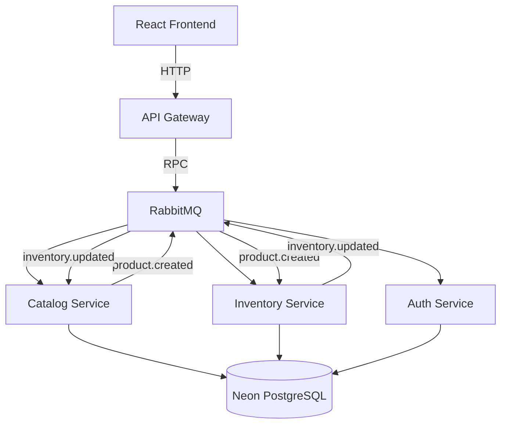

# Challenge Sr Fullstack (Microservicios)

Repositorio monorepo con la solucion completa del challenge:

- backend base analizado y saneado (`nestjs-ecommerce`)
- backend evolucionado a microservicios event-driven (`microservices/*`)
- frontend React con Vite para validacion end-to-end (`react-ecommerce`)
- infraestructura de mensajeria: RabbitMQ local (`infra/docker-compose.yml`) para desarrollo; [CloudAMQP](https://cloudamqp.com) para produccion (Fly.io)

## 1) Problemas detectados en el diseno original

Principales hallazgos en `nestjs-ecommerce`:

- tests de controladores acoplados a modulos de DB y autenticacion
- e2e con problemas de cleanup (`app.close` sin ejecutar correctamente)
- dependencias fragiles en repositorios/mocks para e2e
- guard/auth y configuraciones con acoplamientos que dificultaban evolucion
- base monolitica poco preparada para desacople asincronico entre catalogo e inventario

Correcciones minimas aplicadas:

- aislamiento de tests unitarios de controladores
- estabilizacion de e2e con mocks y teardown correcto
- saneamiento basico para tener baseline reproducible antes de evolucionar

Detalle tecnico ampliado: `microservices/CHALLENGE_NOTES.md`.

## 2) Eventos implementados y por que

Se implementaron dos eventos de dominio relevantes:

1. `product.created`
   - productor: `catalog-service`
   - consumidor: `inventory-service`
   - objetivo: crear/asegurar el registro inicial de inventario de manera desacoplada

2. `inventory.updated`
   - productor: `inventory-service`
   - consumidor: `catalog-service`
   - objetivo: actualizar `lastKnownStock` como read model para consultas del catalogo

Con esto se evita comunicacion sincrona innecesaria entre modulos y se valida consistencia eventual.

## 3) Decisiones tecnicas relevantes

- Arquitectura por bounded contexts: `auth`, `catalog`, `inventory`, `api-gateway`
- Comunicacion asincronica por RabbitMQ para eventos de dominio (local: docker-compose; produccion: CloudAMQP)
- API Gateway como punto HTTP unico para el frontend
- Persistencia en [Neon](https://neon.tech) PostgreSQL (base de datos online `pg-ecommerce`), con enfoque de evolucion progresiva
- Frontend con React + Vite + TanStack Query + componentes estilo shadcn
- UI con actualizaciones optimistas para stock y manejo de asincronia

### 3.1) Frontend (react-ecommerce)

- **Custom hooks**: La logica de la pagina de productos (`useProductsPage`) esta encapsulada en `src/hooks/`. El componente `App` es puramente presentacional y consume datos, estado y handlers de los hooks. Hooks implementados:
  - `use-products-query.ts` — listado de productos con TanStack Query (`useQuery`), cache y `totalStock` derivado
  - `use-create-product.ts` — creacion de productos con stock inicial opcional
  - `use-adjust-stock.ts` — ajuste de stock (+1/-1) con actualizacion optimista y rollback en error
  - `use-product-dialog-state.ts` — estado del modal de edicion (abrir/cerrar, formulario, mensajes de error)
  - `use-product-dialog-mutations.ts` — mutaciones del modal: actualizar producto, eliminar, ajustar stock
  - `use-product-dialog.ts` — composicion de estado y mutaciones del modal de edicion
  - `use-products-page.ts` — orquestador: compone `useProductsQuery`, `useCreateProduct`, `useAdjustStock` y expone la API de la pagina
- **TanStack Query**: `useQuery` para listado de productos (cache, `staleTime`), `useMutation` para crear, actualizar, eliminar y ajustar stock. Actualizaciones optimistas en `onMutate` con rollback en `onError` para una UX fluida sin saltos de pantalla.
- **Componentes**: `CreateProduct` (formulario de alta), `Catalog` (listado con stock total y badges Activo/Inactivo), `ProductDialog` (modal de edicion, actualizacion de stock y eliminacion).
- **Carpeta de types**: Los tipos del frontend estan centralizados en `src/types/` (`product.ts`, `products-page.ts`, `product-dialog.ts`): `Product`, `ProductForm`, `ProductDialogForm`, `CreateProductPayload`, `UpdateProductPayload`, `AdjustStockPayload`, `UseProductsPageResult`, `UseProductDialogResult`, etc.

## 4) Arquitectura backend



El API Gateway envia solicitudes (RPC) a los microservicios via RabbitMQ. Los eventos de dominio fluyen asincronamente: `product.created` (Catalog → Inventory) para inicializar inventario; `inventory.updated` (Inventory → Catalog) para actualizar `lastKnownStock`.

## 5) Como levantar el proyecto

### Prerrequisitos

- Node.js 20+ (recomendado)
- npm
- Docker (para RabbitMQ)

### Variables de entorno

Crear `.env` a partir de los `.env.example` en:

- `microservices/api-gateway/.env.example`
- `microservices/auth-service/.env.example`
- `microservices/catalog-service/.env.example`
- `microservices/inventory-service/.env.example`
- `react-ecommerce/.env.example`

En desarrollo local, el frontend debe apuntar al API Gateway con `VITE_API_URL=http://localhost:3010` (el API Gateway usa puerto 3010 por defecto).

### Arranque local

1. RabbitMQ:

```bash
cd infra
docker compose up -d
```

2. Microservicios (una terminal por servicio):

```bash
cd microservices/auth-service && npm run start:dev
cd microservices/catalog-service && npm run start:dev
cd microservices/inventory-service && npm run start:dev
cd microservices/api-gateway && npm run start:dev
```

3. Frontend:

```bash
cd react-ecommerce
npm run dev
```

## 6) Validacion de calidad

Suites ejecutadas y pasando en esta solucion:

- monolito `nestjs-ecommerce`: unit + e2e
- `microservices/*`: unit + e2e por servicio (catalog-service, api-gateway, inventory-service, auth-service)
- `react-ecommerce`: `type-check` + tests + lint
- builds de backend y frontend

## 7) URLs publicas de acceso

App desplegada en [Fly.io](https://fly.io):

| Servicio                  | URL                                |
| ------------------------- | ---------------------------------- |
| **Frontend**              | https://aleo-ecom-frontend.fly.dev |
| **API Gateway (Backend)** | https://aleo-ecom-gateway.fly.dev  |
| **Base de datos**         | Neon PostgreSQL (`pg-ecommerce`)   |

Ejemplos de endpoints del API Gateway:

- `GET /products` — listado de productos
- `GET /products/:id` — obtener producto por ID
- `POST /products` — crear producto
- `PATCH /products/:id` — actualizar producto
- `DELETE /products/:id` — eliminar producto
- `PATCH /inventory/adjust` — ajustar stock

URLs locales para desarrollo:

- Frontend: `http://localhost:5173`
- API Gateway: `http://localhost:3010`
- RabbitMQ UI: `http://localhost:15672`

## 8) Bonus features

Se agrego funcionalidad **CRUD completa** de productos:

- **Create**: ya existia (crear producto con stock inicial opcional)
- **Read**: listado y detalle de producto (`GET /products`, `GET /products/:id`)
- **Update**: edicion de producto (titulo, descripcion, precio) desde un modal con formulario; actualizacion de stock (+1/-1) dentro del mismo modal
- **Delete**: eliminacion de producto desde el modal de edicion

En el frontend, el modal de edicion (`ProductDialog`) se abre al hacer clic en "Editar" en cada producto del catalogo. Desde alli se puede modificar datos, ajustar stock o eliminar el producto. Las mutaciones usan actualizaciones optimistas y rollback en caso de error. En el backend, el `catalog-service` gestiona create/update/delete; el `inventory-service` crea el registro de inventario al recibir `product.created` y lo elimina al borrar un producto (evento `inventory.delete-by-product`).
